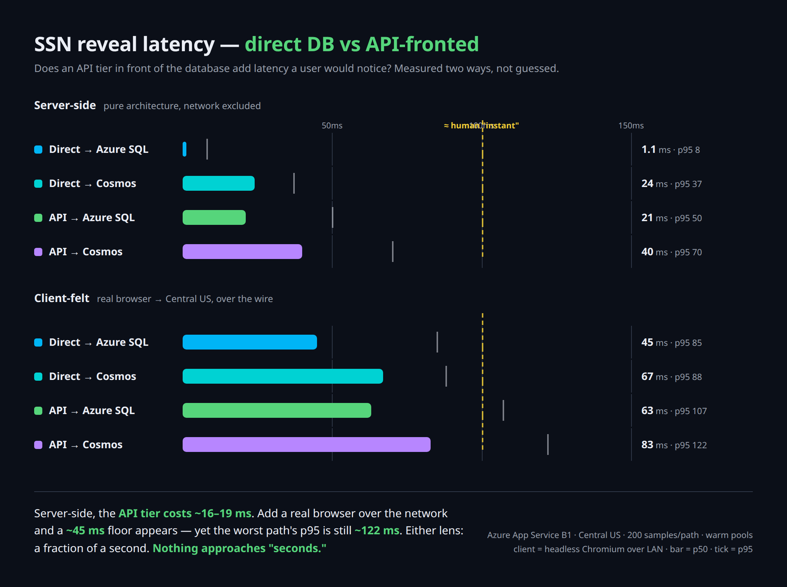
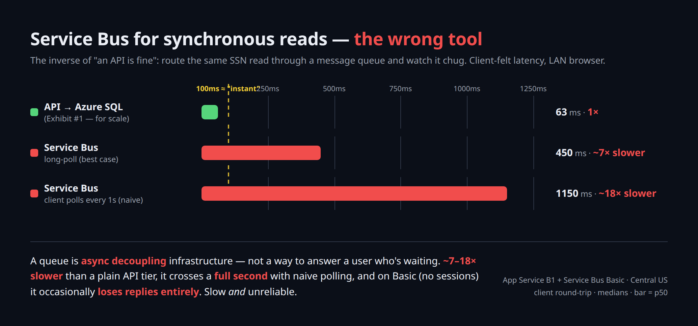
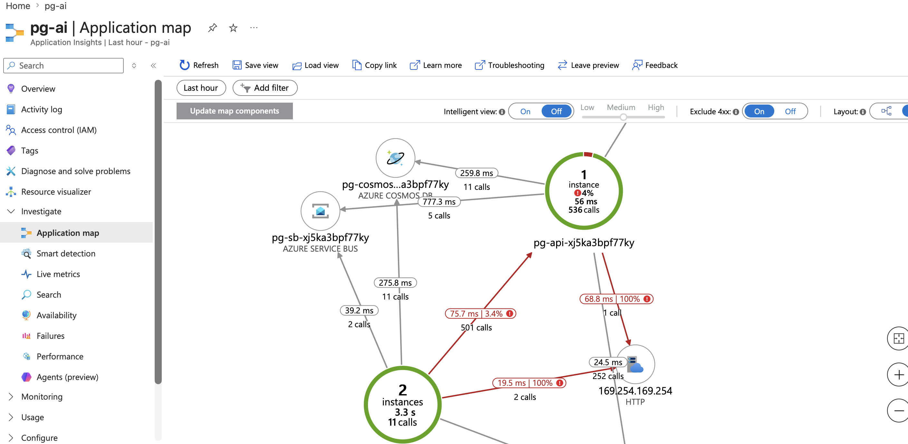

# Exhibits

A running log of what's been bolted onto the frankenstein, and why.

---

## #1 — SSN reveal latency

**The question:** does putting an API tier in front of the database add latency a user would actually notice when unmasking an SSN? A common assumption is that an API call adds seconds; this measures whether that holds.

**The measurement:** reveal one synthetic SSN three ways and time each, server-side, over N samples (one warmup per path excluded):

1. **Direct → Azure SQL** — the GUI queries SQL in-process (the tightly-coupled .NET monolith).
2. **API → Azure SQL** — the GUI calls the API limb, which queries the same SQL.
3. **API → Cosmos** — the GUI calls the API limb, which reads from Cosmos (serverless).

The delta between #1 and #2 **is** the cost of the API tier (network hop + JSON). Same row, same database — the only variable is the API.

**Bolts:** `sql`, `cosmos`, `api`.

**Run it:**
```bash
make all SVC=sql,cosmos,api WARM=1 SQL_PASSWORD='S0me-Str0ng-Pass!'
# open the printed URL → /exhibits/ssn-latency.html → Reveal, then Run benchmark
```

**The honest caveat (shown in the exhibit, not hidden):** the headline numbers are *warm* (`WARM=1` → B1, Always-On, same region). What actually *can* cost seconds is a **cold start** (scale-to-zero / F1 idle unload) or a **cross-region** call — both are choices you control, not inherent to "having an API." On F1 the benchmark still reads clean because it warms each path before measuring; cold start only hits the very first request.

**Data:** one synthetic member (`640-01-2345`) — not real PII.

**Results (2026-06-16, Central US, B1, 200 samples/path):**



| architecture | server p50 | server p95 | client p50 | client p95 |
|---|---|---|---|---|
| Direct → Azure SQL | 1.1 ms | 8 ms | 45 ms | 85 ms |
| Direct → Cosmos | 24 ms | 37 ms | 67 ms | 88 ms |
| API → Azure SQL | 21 ms | 50 ms | 63 ms | 107 ms |
| API → Cosmos | 40 ms | 70 ms | 83 ms | 122 ms |

Server-side the API tier costs ~16–19 ms; client-felt (real Chromium over a LAN) adds a ~45 ms network floor, worst-path p95 still ~122 ms. Nothing approaches "seconds." Graphic generator: [`docs/ssn-latency-chart.html`](docs/ssn-latency-chart.html).

**Status:** live and measured. Locked behind Entra Easy Auth (owner-only).

---

## #2 — Service Bus for synchronous reads (a cautionary tale)

**The point:** the inverse of Exhibit #1. It shows what *actually* earns the "it'll take seconds" reputation — using a message queue for a synchronous read. One in-process call becomes a request/reply round-trip through a broker (~4–6 broker hops), and a naive client poll loop compounds it.

**How it works:** the body sends a request to `reveal-requests`; a background worker in the API limb consumes it, reads SQL, and pushes the answer to `reveal-replies`; the body waits for the reply and times the whole thing. A `?poll=` knob shows how a hand-rolled receive loop makes it worse.

**Bolts:** `sql`, `api`, `sb` (Service Bus Basic).

**Run it:**
```bash
make all SVC=sql,cosmos,api,sb WARM=1 SQL_PASSWORD='...' API_SECRET='...'
# open /exhibits/servicebus.html → Reveal, try the poll modes, Run 10×
```

**Results (2026-06-16, Central US, Basic — client-felt, LAN browser):**



| path / mode | p50 | vs API tier |
|---|---|---|
| API → SQL (Exhibit #1) | ~63 ms | 1× |
| Service Bus · long-poll | ~450 ms | ~7× |
| Service Bus · poll 1s (naive) | ~1,150 ms | ~18× |

All client-felt (same LAN-browser vantage, apples-to-apples). ~7× the API tier at best; naive polling crosses **a full second** (~18×) — the literal "seconds," delivered by the wrong tool. Basic tier has no sessions to correlate replies cleanly, so request/reply over the queue also **occasionally loses replies** — slow *and* unreliable. Queues are for async decoupling, not answering a user who's waiting. Graphic generator: [`docs/servicebus-chart.html`](docs/servicebus-chart.html).

**Status:** live and measured.

---

## #3 — Nervous System (the "ESB" that isn't)

**Question:** Everyone wants an ESB. Do you need a heavy integration suite, or does a Function App + Service Bus cover the real patterns? (Spoiler: a couple of resources.)

**What it bolts on:** `fn` (Functions, Consumption/Y1), `eg` (Event Grid), `sb` (Service Bus), reusing `storage`, `cosmos`. Plus an Application Insights component. Everything flips on via the Makefile, lands in `rg-pg-playground`, scales to zero.

**The five reflexes** (each a copyable function in `src/functions`):

| # | Pattern | Trigger → action |
|---|---------|------------------|
| 1 | Webhook ingress (both paths) | `WebhookDirect` (HTTP) and `EventGridIngress` (Event Grid) → queue `ingress` |
| 2 | Synchronous API | `ApiGet` / `ApiPost` (HTTP) ↔ Cosmos |
| 3 | Pub/sub fan-out | publish → topic `events` → `ConsumerA` + `ConsumerB` (both get a copy) |
| 4 | Queue → adapter → external | `QueueToTarget` (SB queue) → POST to the `src/api` limb |
| 5 | DB change → event | `CosmosChangeFeed` → queue `db-events` |

`A trigger fires a function; the function reads or writes the bus.` Every integration is a variation on that sentence.

**Cost:** ~$0 at rest. Functions on Consumption, Service Bus **Basic** (queues) by default. Fan-out (#3) needs **Standard**, ~$0.0135/hr — a 1–2 hr proving run is pennies. Flip with `SB_TOPICS=1`, run, `make down`.

**Run it:**
```
make all SVC=sql,cosmos,api,sb,storage,eg,fn SB_TOPICS=1   # full demo incl. fan-out
make outputs                                              # Functions URL + Event Grid endpoint
make down                                                 # reclaim everything
```

Runs on a Linux **Consumption (Y1)** plan in its own resource group `rg-pg-playground-fn`
(a Linux Y1 plan can't share an RG with a regular App Service plan, and the dedicated-plan
`dotnet-isolated` runtime images aren't published). **.NET 9 isolated** — no .NET 10 Linux
Functions image exists yet. Post-deploy provisioning (SB entities, Cosmos `items`/`leases`
containers, App Insights, connection settings, the Event Grid → function subscription) is
handled idempotently by `scripts/wire-functions.sh`, called from `make deploy`.

**Verified (2026-06-16):** a write flows end-to-end —
`POST /api/items` → 201 (Cosmos output binding) · `GET /api/items/{id}` round-trips (Cosmos
input binding) · `POST /api/webhook` → 202 lands a message on the `ingress` queue · and the
item write fired the **Cosmos change feed → `db-events` queue**. HTTP → Cosmos → change feed →
Service Bus, proven.

**Status:** live and verified.

---

## #4 — Fan-out, two ways

**The question:** the AWS fan-out everyone knows is SNS → (N×) SQS → Lambda: publish once,
each consumer gets its own durable copy. What does that shape look like in Azure, and what
changes if you build it from the cheap primitives instead of the obvious one?

**What it does:** publishes one event down two paths and shows each of two consumers
receiving its own copy on each path.

- **Service Bus** — a topic `fanout` with subscriptions `f-sub-a` / `f-sub-b`, a function on
  each. This is the close 1:1 to SNS→SQS: a subscription *is* a durable queue, so one
  service does both the broadcast and the per-consumer buffer. Needs **Standard**
  (`SB_TOPICS=1`); topics don't exist on Basic.
- **Event Grid → Storage Queues** — the Event Grid topic fans out via two subscriptions into
  two Storage Queues (`fanout-a` / `fanout-b`), a function draining each. Same shape from
  cheaper parts: Event Grid as the broadcast, a Storage Queue as each consumer's durable
  buffer.

Every consumer writes a receipt to the Cosmos `fanout` container; the app reads receipts by
correlationId so the page lights up each consumer as its copy lands. The publishing lives in
`src/app` (so the UI drives both paths); the consumers are in `src/functions/Fanout4.cs`
(parallel to #3's scenario-3 fan-out, which is left untouched).

**Services:** `sb` (+ `SB_TOPICS=1` for the Service Bus path), `eg`, `storage`, `fn`, plus
`cosmos` for the receipts.

| AWS | Service Bus way | Event Grid way |
|---|---|---|
| SNS topic | Service Bus topic | Event Grid topic |
| SQS queue (per consumer) | topic subscription *(built in)* | Storage Queue per subscription |
| consumer Lambda | function on the subscription | function on the queue |

**Run it:**
```
make all SVC=sql,cosmos,api,sb,storage,eg,fn SB_TOPICS=1
# open the printed URL → /exhibits/fanout.html → Publish once
```

**Status:** live and verified (2026-06-17, Central US). One publish reached all four consumers
— `servicebus` A+B and `eventgrid` A+B — each writing its receipt, in ~10s from cold. Service
Bus delivers in ~3s (warm topic); the Event Grid path runs ~3–4s behind it (extra push +
queue-trigger hop), both well under the 15s poll window.

The unknowns from the build, resolved on the live run:
- **Event Grid → Storage Queue delivery needs no extra identity** — the subscription created
  with just the storage account resource id delivers fine out of the box.
- **The real gotcha was the event shape, not auth.** Publishing a `BinaryData` payload lands
  the data under the CloudEvent's `data_base64` member (base64'd inner JSON), *not* `data` —
  so the consumer's correlationId lookup missed and receipts were written under an unmatchable
  id (delivery, queue, trigger, and Cosmos all worked; only the id was wrong). Fixed both ends:
  publish the data as a JSON object (clean `data`), and the extractor now also cracks
  `data_base64`. Covered by a test so it can't regress.
- **#3/#4 share the Event Grid topic**, so running both at once drops a harmless extra message
  on #3's `ingress` queue (its subscription is unfiltered; #4's are filtered to `pg.fanout`).
  Run one exhibit at a time.

---

## #5 — The App Map draws itself (observability)

**The question:** the pitch is "Application Insights is way better than Dynatrace." Can we
*show* it instead of asserting it — and honestly, without strawmanning a strong competitor?

**The point:** every prior exhibit already calls across App Service, the API tier, SQL, Cosmos,
Service Bus, Event Grid and Functions. Nobody was watching. Turn on Application Insights — **one
resource, one connection string, no agent installed on any host** — and the whole topology, call
rates, dependency latencies and failures appear from the traffic itself. That "no agent rollout +
KQL + $0-at-rest" combination is the defensible case for an Azure-native app; the demo is built to
win on it, not to pretend Dynatrace has no answer (it does — Davis AI root-cause and full-stack
host coverage are real, and the exhibit says so).

**What it adds:**
- **Instrumentation** is one line per app — `AddApplicationInsightsTelemetry()` in the web app and
  the API tier (the Functions app was already instrumented for #3). No role-name overrides: the
  three nodes auto-name as their site names (`pg-app-*`, `pg-api-*`, `pg-fn-*`). Dependency calls
  (SQL, Cosmos, the HTTP hop, Service Bus, Event Grid) and the request graph are captured
  automatically, W3C-correlated end-to-end.
- **App Insights is now always-on**, provisioned by `scripts/wire-observability.sh` (workspace-based
  `pg-ai` in `rg-pg-playground`) and the connection string injected into both apps by `make deploy`.
  Free at rest — pay only per GB ingested — so it costs nothing until you generate load.
- **A load generator + fault injection.** `POST /api/observe/load?n=&faultPct=&chain=` drives N
  end-to-end transactions through the stack (`chain=full` adds the Service Bus / Event Grid →
  Functions hop). A `faultPct` slice asks the API tier to misbehave — `?fault=error` (500, red edge)
  or `?fault=slow` (amber) — evenly spread so the map shows a steady failed/slow fraction. Each
  transaction emits a custom metric (`pg.txn.ms`) and event (`pg.txn`) with outcome/fault dimensions.
- **Page** at `/exhibits/observability.html`: run load, see the counts, then deep-link straight to
  the portal's App Map / Live Metrics / Failures / Performance / Logs blades (built from
  `AI_RESOURCE_ID`). The honest Dynatrace comparison table lives on the page.
- **A KQL query pack** — [`docs/observability-kql.md`](docs/observability-kql.md) — the app map as a
  query, the end-to-end transaction replay, the custom metric/event breakdowns. KQL is the part of
  the pitch that's hardest to argue with.

**Services:** `api` + `cosmos` at minimum (web → API → SQL/Cosmos); add `sb,storage,eg,fn`
(`SB_TOPICS=1`) for the full-chain map. App Insights itself needs no toggle — it's wired on every deploy.

**Run it:**
```
make all SVC=sql,cosmos,api,sb,storage,eg,fn SB_TOPICS=1   # full topology on the map
# open the printed URL → /exhibits/observability.html → set fault %, Run load
# wait ~30–90s, then click "Application Map ▸"
```

**Tests:** fault parsing, the even fault-spread (count matches the percentage exactly, no clumping),
and the portal-link builder are covered in `ObservabilityTests` (no Azure needed).

**Status:** live and verified (2026-06-24, Central US). One deploy +
`POST /api/observe/load?n=100&faultPct=30&chain=full` drew the full map from telemetry alone:



The red edges into `pg-api` carry the injected-fault failure rates (one at 100%); node rings show the
error percentage. The whole graph is auto-discovered — nothing here was drawn by hand.

- **3 nodes** by cloud role — `pg-app` (web), `pg-api`, `pg-fn` — auto-named, no config.
- **Edges, all auto-captured:** `pg-app → pg-api` (HTTP), `pg-app → Cosmos` (direct), `pg-app →
  Service Bus /fanout`, `pg-api → Cosmos` (SQL off this run), `pg-fn → Cosmos` (the fan-out
  consumers writing receipts). Service Bus, Event Grid, Cosmos and the HTTP hop all show as typed
  dependency edges.
- **Fault injection landed as real failures:** `pg-api` logged 18 failed requests and the
  `pg-app → pg-api` edge 17 failed calls (the injected 500s) — a red edge on the map. The `slow`
  faults show as the fat p95 (~470ms vs ~70ms baseline).
- **Cross-process correlation across the async bus hop works:** trace context propagates web →
  Service Bus → Functions (operation_Ids span `pg-app` and `pg-fn`). Functions isolated-worker
  correlates a subset of bus-triggered invocations; the dependency edge is drawn regardless.

A live-run gotcha worth keeping: **F1 serves the old code for ~30–60s after a zip redeploy** — the
first load run after a code change reported stale behaviour (faults not failing) until the new
instance took over. Warm with a throwaway request and re-run, or use `WARM=1` (B1) for a demo.

One bug the live run caught that the unit tests didn't: the error/slow split was keyed on
transaction index parity, but `IsFaultIndex` can hand back indices that all share a parity (every
4th at 25%), so every fault came out the same kind. Fixed to alternate on the fault-event counter.

**For a demo:** add `sql` for the Azure SQL node (+$5/mo) and `WARM=1` for no cold-start (B1,
+$13/mo). Tear down with `make down` after.
