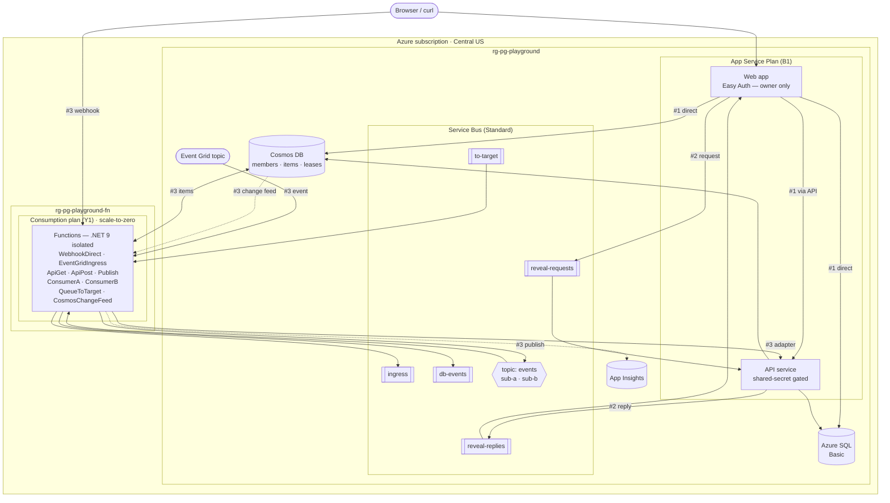

# azure-playground — architecture

One subscription, **two resource groups**, three exhibits. Everything is created by a
single `make all` from the subscription-scoped `infra/playground.bicep`, and `make down`
deletes both resource groups.

## Exhibit key

| # | Exhibit | What it shows | Services |
|---|---------|---------------|----------|
| 1 | **SSN reveal latency** | An API tier costs ~16–19 ms, not "seconds" | Web app, API, SQL, Cosmos |
| 2 | **Service Bus for sync reads** | The anti-pattern that *does* cost seconds | Web app, API, Service Bus queues |
| 3 | **Nervous System** | The "ESB" is just Functions + a bus (5 reflexes) | Functions, Service Bus (queues + topic), Event Grid, Cosmos, App Insights |

## Why two resource groups

The **RG is the platform's unit of deployment and teardown.** The web/API tier and its data
sit in `rg-pg-playground`; the integration tier (Functions) sits in `rg-pg-playground-fn`.
That separation is required, not cosmetic: a Linux **Consumption (Y1)** Functions plan cannot
share a resource group with a regular App Service plan
(`LinuxDynamicWorkersNotAllowedInResourceGroup`). Its own RG gives it a clean home and true
scale-to-zero. The Functions reach Service Bus / Cosmos / SQL in the main RG over connection
strings (same subscription). `make down` removes both.

## Notes

- **Region:** Central US (East US blocks new Azure SQL; East US 2 has no App Service quota for this subscription).
- **Auth:** the web app is locked to a single Entra account via App Service Easy Auth; the API
  is reached server-to-server with a shared-secret header.
- **Runtimes:** web app + API on **.NET 10**; Functions on **.NET 9 isolated** (no published
  .NET 10 Linux Functions image yet).
- **Cost:** ~$0 at rest except Azure SQL Basic (~$5/mo) and, while running the fan-out demo,
  Service Bus Standard (~$0.0135/hr). The B1 plan is ~$13/mo while up.
